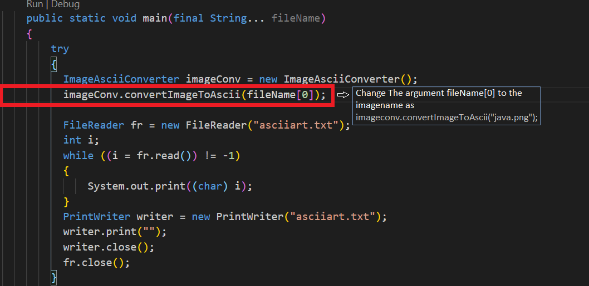

# Image-To-Ascii_Art in Java
[](http://unlicense.org/)
[](https://github.com/dhvakr?tab=followers)
[](https://twitter.com/dhvakr)
[](http://unmaintained.tech/)


 **This contain code to Convert an Image to Ascii using java, Refer below steps to get started** 
## Tested Image Formats
**PNG | JPG**

### `STEP 1 :`
      Compile a java file "AsciiImageConverter.java"
## **Figure 1**
<p align = "center">

</p>

### `STEP 2 :`
   Run the class File in CLI (Command Prompt / Terminal) with image name
  ```yaml
    Example : java AsciiImageConverter java.png

    (java.png is the image name of ur expecting image)
    Refer : Figure 2
```
* Load any image you're interested in (Make sure u are typing correct image name)

  ## **Figure 2**
<p align = "center">

</p>

> If you expecting to Run this code in your preferred IDE, Instead of CLI, skip all other instruction and pass the image name directly in `line no 64` at `ImageAsciiConverter.java` file
  
   (i,e) at line no : 64 remove fileName[0] and pass argument as your image name ('java.png") instead of fileName[0] 
```yaml
  Refer: Figure 3
```
> @ Line 64 => imageConv.convertImageToAscii(`"java.png"`);

## **Figure 3**
<p align = "left">

</p>

**Excepted Change To Run via IDE**

<p align = "right">

</p>

This code also supports single launch source file, Run this code with single command `java AsciiImageConverter.java java.png`  in terminal

  > Refer : [JEP330](https://openjdk.java.net/jeps/330) for more information.

  You are expected to have java-11 to perform single launch source file execution in terminal

## SAMPLE OUTPUT : 


```yaml
To-Clone Repo :
        https://github.com/dhvakr/Image-To-Ascii_Art
```  
This project is refactored and not actively maintained.. if found any bug in this code!? leave me alone and solve the bugs by yourself😐
refer [No Maintenance Intended badge](https://unmaintained.tech/)

---
### `LICENSE -> ` 

Distributed under the The Unlicense. See [LICENSE](https://github.com/dhvakr/Image-To-Ascii_Art/blob/main/LICENSE) for more information.

---
### REMEMBER :
*   Algorithm Tested with jpg and png Image formats only
*   Try to run images below 150 * 150 dimension height and width for better viewing 
    (provided some images for testing this code , Check `SampleImages/` Folder)
*   Keep executing images in source file directory (i,e) Outside of Sample Image folder

### Contact :

``` Twitter : ``` [@dhvakr](https://twitter.com/dhvakr)

*Feedbacks are precious, please make some time to give your feedback, Thank u☺*